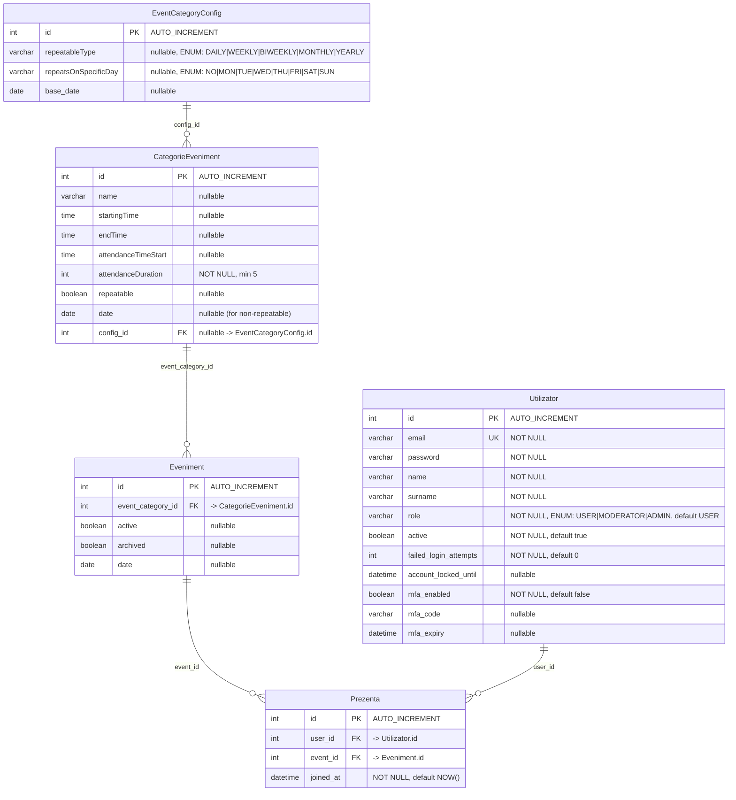

# PRESSYNC Database Schema

## Entity Details

### Utilizator (Users)

| Column | Type | Constraints | Description |
|---|---|---|---|
| `id` | `INT` | PK, AUTO_INCREMENT | Unique user identifier |
| `email` | `VARCHAR(255)` | UNIQUE, NOT NULL | Login email (used as Spring Security username) |
| `password` | `VARCHAR(255)` | NOT NULL | BCrypt-hashed password |
| `name` | `VARCHAR(255)` | NOT NULL | First name |
| `surname` | `VARCHAR(255)` | NOT NULL | Last name |
| `role` | `VARCHAR(255)` | NOT NULL, default `USER` | User role — one of `USER`, `MODERATOR`, `ADMIN` |
| `active` | `BIT/TINYINT` | NOT NULL, default `true` | Whether the account is enabled |
| `failed_login_attempts` | `INT` | NOT NULL, default `0` | Counter for failed logins |
| `account_locked_until` | `DATETIME` | nullable | Timestamp until account is locked |
| `mfa_enabled` | `BIT/TINYINT` | NOT NULL, default `false` | Whether MFA is enabled |
| `mfa_code` | `VARCHAR(255)` | nullable | One-time MFA code |
| `mfa_expiry` | `DATETIME` | nullable | MFA code expiration timestamp |

**Java entity:** `User.java` — implements `UserDetails` (Spring Security)

---

### EventCategoryConfig (Category Configuration)

| Column | Type | Constraints | Description |
|---|---|---|---|
| `id` | `INT` | PK, AUTO_INCREMENT | Unique config identifier |
| `repeatableType` | `VARCHAR(255)` | nullable | Repeat frequency — one of `DAILY`, `WEEKLY`, `BIWEEKLY`, `MONTHLY`, `YEARLY` |
| `repeatsOnSpecificDay` | `VARCHAR(255)` | nullable | Day filter — one of `NO`, `MON`, `TUE`, `WED`, `THU`, `FRI`, `SAT`, `SUN` |
| `base_date` | `DATE` | nullable | Base date for repeat calculations |

**Java entity:** `EventCategoryConfig.java` — cascade ALL to `EventCategory`

---

### CategorieEveniment (Event Categories)

| Column | Type | Constraints | Description |
|---|---|---|---|
| `id` | `INT` | PK, AUTO_INCREMENT | Unique category identifier |
| `name` | `VARCHAR(255)` | nullable | Category name (e.g. "Morning Yoga", "Workshop") |
| `startingTime` | `TIME` | nullable | Scheduled start time of the event |
| `endTime` | `TIME` | nullable | Scheduled end time |
| `attendanceTimeStart` | `TIME` | nullable | When attendance window opens |
| `attendanceDuration` | `INT` | NOT NULL (min 5) | Attendance marking window in minutes |
| `repeatable` | `BIT(1)` | nullable | Whether the category repeats |
| `date` | `DATE` | nullable | Specific date for non-repeatable events |
| `config_id` | `INT` | FK -> `EventCategoryConfig.id`, nullable | Link to recurrence configuration |

**Relationships:**
- **Many-to-One** -> `EventCategoryConfig`
- **One-to-Many** -> `Event`

---

### Eveniment (Events)

| Column | Type | Constraints | Description |
|---|---|---|---|
| `id` | `INT` | PK, AUTO_INCREMENT | Unique event identifier |
| `event_category_id` | `INT` | FK -> `CategorieEveniment.id` | Links to the parent category |
| `active` | `BIT/TINYINT` | nullable | Whether the event is currently active |
| `archived` | `BIT/TINYINT` | nullable | Whether the event is archived |
| `date` | `DATE` | nullable | Date the event takes place |

**Relationships:**
- **Many-to-One** -> `CategorieEveniment`
- **One-to-Many** -> `Prezenta`

---

### Prezenta (Attendance)

| Column | Type | Constraints | Description |
|---|---|---|---|
| `id` | `INT` | PK, AUTO_INCREMENT | Unique attendance record identifier |
| `user_id` | `INT` | FK -> `Utilizator.id`, part of UK | Attending user |
| `event_id` | `INT` | FK -> `Eveniment.id`, part of UK | Event attended |
| `joined_at` | `DATETIME` | NOT NULL, default `NOW()` | Timestamp when attendance was marked |

**Unique constraint:** `(user_id, event_id)` — a user can only attend a given event once.

**Relationships:**
- **Many-to-One** -> `Utilizator`
- **Many-to-One** -> `Eveniment`

---

## Relationship Summary

| From | To | Type | FK Column(s) | Cascade |
|---|---|---|---|---|
| `EventCategoryConfig` | `EventCategory` | One-to-Many | `config_id` on `CategorieEveniment` | `CascadeType.ALL` |
| `EventCategory` | `EventCategoryConfig` | Many-to-One | `config_id` | none |
| `EventCategory` | `Event` | One-to-Many | `event_category_id` on `Eveniment` | none |
| `Event` | `EventCategory` | Many-to-One | `event_category_id` | none |
| `Event` | `Attendance` | One-to-Many | `event_id` on `Prezenta` | none |
| `Attendance` | `Event` | Many-to-One | `event_id` | none |
| `Attendance` | `User` | Many-to-One | `user_id` | none |
| `User` | `Attendance` | One-to-Many | `user_id` on `Prezenta` | none |

## Enums

### UserRoles
| Value | Description |
|---|---|
| `USER` | Standard user |
| `MODERATOR` | Moderator with elevated permissions |
| `ADMIN` | Full system administrator |

### RepeatableType
| Value | Description |
|---|---|
| `DAILY` | Repeats every day |
| `WEEKLY` | Repeats every week |
| `BIWEEKLY` | Repeats every two weeks |
| `MONTHLY` | Repeats every month |
| `YEARLY` | Repeats every year |

### RepeatsOnSpecificDay
| Value | Description |
|---|---|
| `NO` | No specific day filter |
| `MON`–`SUN` | Only on this day of the week |

## Technology Stack

| Component | Technology |
|---|---|
| **ORM** | Spring Data JPA (Hibernate) |
| **Database** | MariaDB (MySQL-compatible) |
| **DDL Strategy** | `spring.jpa.hibernate.ddl-auto=update` |
| **Database Name** | `pressync` |
| **Connection** | `jdbc:mariadb://localhost:3306/pressync` |
